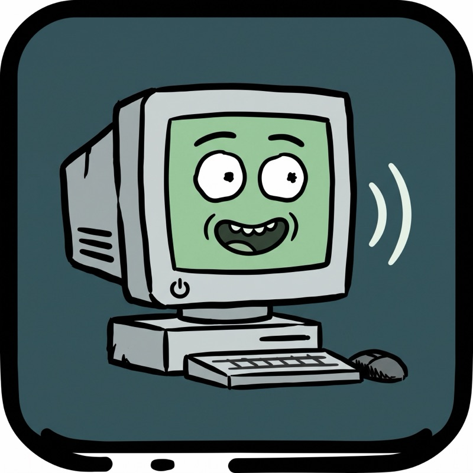
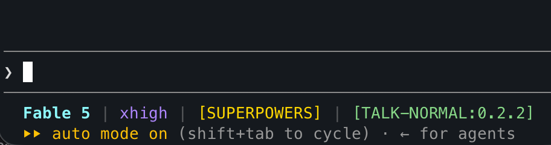

# talk-normal

<p align="center">
  
</p>

A skill that makes your coding agent write like a competent engineer who respects your time: answer first, plain words, whole sentences, nothing decorative.

## Why

Agent output fails in two independent ways. The *shape* fails — the answer comes last, the steps are mixed into prose, and every message ends with "Hope this helps!". And the *language* fails — synonyms rotate mid-explanation, passive voice removes the actor, and "leveraging robust solutions" has no meaning.

talk-normal fixes both at once:

- **Language rules**, adapted from ASD-STE100 — the controlled English the aerospace industry wrote so a maintenance instruction cannot be misread. One meaning per word. Active voice. Sentences stay at 20–25 words at most, and the articles stay: this is the opposite of telegram-style compression, because dropped words create ambiguity.
- **Delivery rules** — the point arrives in line one, work becomes numbered steps, progress is restated every turn, and the message stops when its job is done.

The rules follow the work. A prompt written for a subagent carries the ruleset. The agent rewrites relayed subagent prose; code, data, and errors pass through unchanged.

## Before / after

Without the skill:

> Sure! So looking into this, it seems like the issue you're experiencing might possibly be related to how the retry logic is being handled. There are several factors at play here worth unpacking. One robust approach would be to consider adjusting the backoff configuration, which should hopefully help. Let me know if you'd like me to elaborate on anything!

With it:

> Retries stop after one attempt because `maxRetries` reads from the wrong env var.
>
> 1. In `queue.config.ts:14`, change `RETRY_LIMIT` to `QUEUE_RETRY_LIMIT`.
> 2. Run `pnpm test queue`.
>
> Next: paste the test output if anything still fails.

A status update, without the skill:

> Quick update! I've been diving into the deployment issue and made some great progress. I've now gone ahead and refactored the config loading, which should hopefully make things more robust going forward. There are still a couple of things I'd like to polish, but we're definitely getting there! Let me know how you'd like to proceed.

With it:

> Config loading is fixed; two of three deploy steps pass. The `staging` step still fails because the bucket name is hardcoded. Next: I move the name to `deploy.env` — about ten minutes.

A design question, without the skill:

> That's a great question! There are actually several ways to approach caching here, and the best choice really depends on your specific use case. You could leverage Redis, or alternatively an in-memory solution might be a seamless fit. Each has trade-offs worth exploring further. Happy to dive deeper into any of these!

With it:

> Use the in-memory cache. Your data fits in 40 MB and one process serves all traffic, so Redis would add a network hop and a service to run. Choose Redis when a second app server appears.

## Install

Two activation models, depending on what the harness lets a plugin do:

- **On by default** — Claude Code (terminal and desktop Code tab), Codex CLI after a one-time hook trust, Pi, and Gemini's extension route. The rules apply from the first message of every session; disabling or removing the plugin turns them off.
- **Per session or per relevance** — chat apps and the smaller skills harnesses. Those surfaces load skills on invocation or by relevance; the [instructions block](#the-instructions-block) is their always-on substitute.

<details>
<summary><strong>Claude Code</strong></summary>

Via the Astro Foundry marketplace:

```bash
claude plugin marketplace add astrofoundry/agent-skills
claude plugin install talk-normal@astrofoundry
```

Or directly from this repository: `claude plugin marketplace add astrofoundry/talk-normal`, then `claude plugin install talk-normal@talk-normal`.

The rules apply from the first message of every new session. `claude plugin list` checks the install; `claude plugin marketplace update astrofoundry` updates it.

Turn it off with `claude plugin disable talk-normal` or `claude plugin uninstall talk-normal` — both apply to new sessions; a session that already loaded the rules keeps them until it ends. Re-invoke mid-session with `/talk-normal:talk-normal` (autocomplete completes it from `/talk`).

The **Claude desktop app's Code tab** runs the same engine and configuration. Install once with the commands above; local and SSH Code sessions load the rules identically. Cloud sessions have no plugin browser — declare the plugin in the project's `.claude/settings.json` under `enabledPlugins` — and WSL sessions do not load plugins. The Chat tab is a chat app; see the Chat apps section.

<details>
<summary><strong>Auto-update (optional)</strong></summary>

Third-party marketplaces do not auto-update by default. Two ways to turn it on for this one:

- Open `/plugin`, select the marketplace you added (`astrofoundry` or `talk-normal`), and enable auto-update.
- Or set it in `~/.claude/settings.json` on your marketplace entry:

```json
{
  "extraKnownMarketplaces": {
    "astrofoundry": {
      "source": { "source": "github", "repo": "astrofoundry/agent-skills" },
      "autoUpdate": true
    }
  }
}
```

Claude Code then checks for updates in the background after each session starts. When an update arrives, it prompts you to run `/reload-plugins`, which switches skills and hooks to the new version without a restart. Without auto-update, run `claude plugin update talk-normal@astrofoundry` yourself. `claude plugin list` shows the installed version either way.

</details>

<details>
<summary><strong>Statusline badge (optional)</strong></summary>

The plugin ships `statusline/badge.mjs`: it prints a green `[TALK-NORMAL:<installed version>]`. The block below runs it only while the plugin is enabled, so a disabled plugin shows no badge — the absence is the off state.



Add this block to your own statusline script (the one `statusLine.command` in settings.json points at), anywhere after it resolves `$proj` from the workspace JSON:

```bash
tn=""
for f in "$HOME/.claude/settings.json" "$proj/.claude/settings.json" "$proj/.claude/settings.local.json"; do
  [ -f "$f" ] || continue
  v=$(jq -r '(.enabledPlugins // {}) | if has("talk-normal@astrofoundry") then .["talk-normal@astrofoundry"] | tostring else empty end' "$f" 2>/dev/null)
  [ -n "$v" ] && tn=$v
done
if [ "$tn" = "true" ]; then
  ip=$(jq -r '.plugins["talk-normal@astrofoundry"][0].installPath // empty' "$HOME/.claude/plugins/installed_plugins.json" 2>/dev/null)
  [ -n "$ip" ] && badge=$(node "$ip/statusline/badge.mjs" 2>/dev/null) && [ -n "$badge" ] && printf ' %s' "$badge"
fi
```

The `enabledPlugins` gate reads the last settings file that mentions the plugin. A project-level `false` wins over a user-level `true`, and the badge disappears when you disable the plugin. The install path comes from `installed_plugins.json` — the version Claude Code installed, not the newest directory in the cache. If you installed through the direct route, replace `astrofoundry` with `talk-normal` in the plugin key. If you have no statusline script, see the statusline page in the Claude Code docs for the two-line `statusLine` settings entry that creates one.

</details>

</details>

<details>
<summary><strong>Codex</strong></summary>

On by default after a one-time step: the plugin bundles a `SessionStart` hook that loads the ruleset into every session, and Codex needs you to trust that hook once.

1. Register the marketplace: `codex plugin marketplace add astrofoundry/talk-normal`.
2. Start `codex` and open the plugin browser — the **Plugins** screen, listed in the `/` command menu. Select the `talk-normal` marketplace and install **talk-normal**. There is no CLI install command; installation goes through this screen.
3. Run `/hooks`, review the talk-normal `SessionStart` hook, and trust it. Codex skips untrusted plugin hooks by design.

From the next session, the rules load at start — the footer shows "Loading talk-normal ruleset" while the hook runs. Node.js must be on your PATH. `codex plugin marketplace list` checks the marketplace; `codex plugin marketplace upgrade talk-normal` updates it.

Turn it off by untrusting the hook in `/hooks`, or remove the plugin in the plugin browser and run `codex plugin marketplace remove talk-normal`. Without the trusted hook, the plugin still works per session: type `$talk-normal` in the composer. Codex does not activate the skill on its own.

The **ChatGPT desktop app** (Codex or Work mode) installs the same plugin: after the `marketplace add`, open **Plugins** in the app, select the `talk-normal` marketplace, and install. Type `@` in the composer to invoke the skill per chat. Chat mode is a chat app; see the Chat apps section.

<details>
<summary><strong>Enterprise setups where `marketplace add` fails</strong></summary>

Managed Codex deployments can restrict marketplace sources (`requirements.toml`, `restrict_to_allowed_sources`), and the add then fails. The skill still installs without the marketplace, because Codex reads standalone skills from `~/.codex/skills/`:

```bash
git clone https://github.com/astrofoundry/talk-normal
mkdir -p ~/.codex/skills
cp -R talk-normal/skills/talk-normal ~/.codex/skills/
```

Codex detects the new skill automatically; restart it if `$talk-normal` does not appear. This route is per-session invocation — the plugin's always-on hook does not travel with a standalone skill. To rebuild always-on, point a user-level `SessionStart` hook in `~/.codex/hooks.json` at the copied skill, and trust it in `/hooks`; managed policy decides whether non-managed hooks run.

</details>

</details>

<details>
<summary><strong>Pi</strong></summary>

Pi reads this repository as a native package, and the mode is on by default: the extension injects the ruleset at every new, resumed, forked, or reloaded session, and injects it again when compaction drops it.

```bash
pi install https://github.com/astrofoundry/talk-normal
```

The footer shows `● TALK NORMAL` while the package is installed. `pi list` checks the install; `pi update --extensions` updates it. Turn it off by removing the package: run `pi list`, copy the talk-normal source string, then `pi remove <source>`. The Agent Skills command stays available as an alias: `/skill:talk-normal`.

</details>

<details>
<summary><strong>Other harnesses</strong></summary>

Each of these loads the skill from this repository; activation is per session unless noted.

**Gemini CLI** — the extension route is on by default (the extension loads `GEMINI.md`, which imports the full skill):

```bash
gemini extensions install https://github.com/astrofoundry/talk-normal
```

For a per-session command instead, copy [gemini.toml](skills/talk-normal/agents/gemini.toml) to `~/.gemini/commands/talk-normal.toml` and type `/talk-normal`. Uninstall: `gemini extensions uninstall talk-normal` or delete the command file.

**Qwen Code** — `qwen extensions install astrofoundry/talk-normal`, then `/talk-normal` at the start of a session. Uninstall: `qwen extensions uninstall talk-normal`.

**Kimi Code CLI** — run `/plugins`, choose **Custom**, paste `https://github.com/astrofoundry/talk-normal`, and trust. Then `/skill:talk-normal` per session.

**GitHub Copilot** — `npx skills add astrofoundry/talk-normal -a github-copilot` (add `-g` for all projects), then `/talk-normal` per chat.

**Zed** — Agent Panel → Skills manager → **Create skill from URL** with `https://github.com/astrofoundry/talk-normal/blob/main/skills/talk-normal/SKILL.md`, then `/talk-normal` per chat.

**Cursor, OpenCode, and any other agent-skills harness** — run `npx skills add astrofoundry/talk-normal` (add `-a cursor` or your agent). Type `/talk-normal` per chat. Without the CLI, copy `skills/talk-normal/` into the directory your agent scans.

</details>

<details>
<summary><strong>Chat apps</strong></summary>

Chat surfaces have no plugin layer. The always-on route is a persistent instructions field; the skill route uploads the same `SKILL.md` the plugin ships.

**claude.ai chat (web and the Claude desktop Chat tab)**

- Always on: open **Settings → Profile**, find **Instructions for Claude**, and paste [the instructions block](#the-instructions-block). It applies to every chat on the account; remove it to turn it off.
- The skill (Pro/Max/Team/Enterprise): download `talk-normal-skill.zip` from the [latest release](https://github.com/astrofoundry/talk-normal/releases/latest), open **Settings** and go to the **Skills** area (current app versions place it under **Customize**), enable prerequisites the page asks for, upload the ZIP, and toggle the skill on. Claude applies it when a chat matches its description, or when you ask for it by name — the instructions block remains the only guaranteed always-on.

**ChatGPT Chat mode**

Chat mode loads no plugins and no skills. Paste [the instructions block](#the-instructions-block) into ChatGPT's custom-instructions field (Settings → Personalization); it applies to your chats until you remove it. Work mode and the Codex surface install the real plugin — see the Codex section.

</details>

## The instructions block

Chat surfaces without a plugin layer (claude.ai chat, ChatGPT Chat mode) use this block as their persistent instructions:

```markdown
Write the way a competent engineer talks to a colleague whose time is short.

Say it plainly:
- Use one meaning per word and one verb per action; never rotate synonyms. Prefer everyday verbs (use, make sure, check, start, stop, show, fix, change, remove, need).
- Use the active voice and name the actor. Use simple tenses only.
- Use at most 20 words per instruction sentence and at most 25 per description sentence. One instruction per sentence. Keep the articles; never compress words away.
- Rewrite multi-word nouns longer than three words. One topic per paragraph, six sentences maximum. Lead warnings with the danger.

Say it in a useful order:
1. The first line carries the point.
2. Multi-step work becomes a numbered list of bounded actions.
3. State where things stand every turn.
4. Close with one next move the reader can do in under two minutes.
5. Errors get a location, a cause, and a fix.
6. Show results concretely. Give estimates in units. Cap lists at five items. Tangents get one sentence at the end. No warm-up, no recap, no sign-off.

Never write these in your own prose: delve, dive into, deep dive, leverage, seamless, seamlessly, robust/powerful/comprehensive as decoration for code or tools, "it's worth noting", "great question", "as an AI", journey/landscape/ecosystem as metaphors, game-changing, cutting-edge, state-of-the-art, padding adverbs (basically, essentially, actually, simply, just), idioms and figures of speech. Code, commands, paths, identifiers, data, error text, and quotes pass through exactly. Precision outranks style: never drop a fact, a number, or a condition to make a sentence shorter.

When you send work to a subagent, include these rules in its prompt. Rewrite the prose of relayed subagent output — never its code, data, or errors.

Bend only here: explanations and walkthroughs may run long, and the shape stays. A destructive step gets a full-sentence warning and a pause for confirmation — safety outranks every other rule. After three failed fixes, stop, name the doubtful assumption, and ask one diagnostic question. An ambiguous request earns one short question. The harness's own rules win everywhere except safety; keep the spirit of these rules inside them.
```

## Customize

The full ruleset is one file: [skills/talk-normal/SKILL.md](skills/talk-normal/SKILL.md) — every harness reads or derives from it. Fork the repository, edit that file, then install your fork (Claude Code: `claude plugin marketplace add <you>/talk-normal`, then `claude plugin install talk-normal@talk-normal`).

## Troubleshooting

**The slash command is missing.** The command index builds at startup; open a fresh session after you install.

**The rules do not apply in a new Claude Code session.** The plugin is disabled, or an old version is loaded — check `claude plugin list`, update, and run `/reload-plugins` or restart.

**The rules do not load in Codex.** The bundled `SessionStart` hook is not trusted, and Codex skips untrusted plugin hooks by design; run `/hooks`, trust the talk-normal hook, and start a new session.

**`marketplace add` rejects a local path.** The path points inside the repository; point it at the directory that *contains* `.claude-plugin/`, not at `.claude-plugin/` itself.

**Output drifts back to slop mid-session.** Older instructions lose force in a long session; re-invoke the skill (`/talk-normal:talk-normal` in Claude Code). On-by-default surfaces re-load the rules at every new session and after compaction.

## Credits

The delivery layer adapts ideas from [i-have-adhd](https://github.com/ayghri/i-have-adhd) by Ayoub G. (MIT). The language layer derives from ASD-STE100 Simplified Technical English, Issue 9. ASD-STE100 is a copyright and trademark of ASD, Brussels — this skill is an independent adaptation, not certified STE.

## License

MIT.
